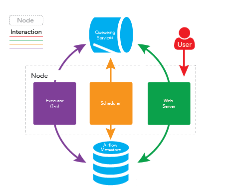

crontab，Linux下的计划任务管理工具。
crontab的服务进程名为crond，英文意为周期任务。顾名思义，crontab在Linux主要用于周期定时任务管理。通常安装操作系统后，默认已启动crond服务。crontab可理解为cron_table，表示cron的任务列表。
在cron定时调度中，可以通过在命令行中添加依赖关系来保证任务能够按照正确的顺序运行。具体来说，可以使用&&和||指令来声明任务之间的依赖关系。&& 表示前面任务成功则继续后面任务，|| 表示前面任务失败则执行后面任务。
```shell
#!/bin/bash
# 执行依赖任务
task1.sh

# 判断依赖任务是否完成
while [ ! -f "task1.done" ] #判断 task1.done 文件是否存在
do
# 如果未完成，则等待5秒后再检查
sleep 5
done

# 执行当前任务
task2.sh
```

# 每10分钟执行一次任务2，并在任务1执行完成后执行
*/10 * * * * sleep $(find /path/to/task1.done -mmin -10) && task2.sh
使用sleep命令等待时间，该命令会等待一个时间段，这里使用了find命令来查找task1.done文件的修改时间，如果时间小于10分钟，则sleep命令会等待相应的时间，否则立即执行。接着，使用&&符号来连接两个命令，表示只有当第一个命令执行成功后才会执行第二个命令。

airflow已经成为了任务编排系统的事实标准，使用和terraform一样的代码及配置的任务开发方式。
airflow使用python作为开发语言，非常简单易学、容易上手。

airflow installation:

https://airflow.apache.org/docs/apache-airflow/stable/start.html

Airflow 的架构
在一个可扩展的生产环境中，Airflow 含有以下组件：

元数据库：这个数据库存储有关任务状态的信息。
调度器：Scheduler 是一种使用 DAG 定义结合元数据中的任务状态来决定哪些任务需要被执行以及任务执行优先级的过程。 调度器通常作为服务运行。
执行器：Executor 是一个消息队列进程，它被绑定到调度器中，用于确定实际执行每个任务计划的工作进程。 有不同类型的执行器，每个执行器都使用一个指定工作进程的类来执行任务。 例如，LocalExecutor 使用与调度器进程在同一台机器上运行的并行进程执行任务。 其他像 CeleryExecutor 的执行器使用存在于独立的工作机器集群中的工作进程执行任务。
Workers：这些是实际执行任务逻辑的进程，由正在使用的执行器确定。



Airflow 适用于调度作业较为复杂，特别是各作业之间的依赖关系复杂的情况。
Airflow是一个 Airbnb 的 Workflow 开源项目，使用Python编写实现的任务管理、调度、监控工作流平台。 Airflow是基于DAG(有向无环图)的任务管理系统，可以简单理解为是高级版的crontab，但是它解决了crontab无法解决的任务依赖问题。 与crontab相比Airflow可以方便查看任务的执行状况（执行是否成功、执行时间、执行依 赖等），可追踪任务历史执行情况，任务执行失败时可以收到邮件通知，查看错误日志。

