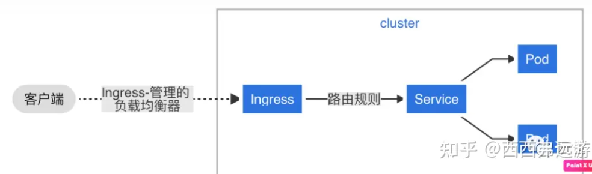

-------------------------------------------------------------------------------
K8s service 是4层负载均衡
Ingress 是7层(http) 负载均衡

-------------------------------------------------------------------------------
k8s-------kube-proxy和service
kube-proxy
kube-proxy负责为Service提供cluster内部的服务发现和负载均衡，它运行在每个Node计算节点上，负责Pod网络代理, 它会定时从etcd服务获取到service信息来做相应的策略，维护网络规则和四层负载均衡工作。在K8s集群中微服务的负载均衡是由Kube-proxy实现的，它是K8s集群内部的负载均衡器，也是一个分布式代理服务器，在K8s的每个节点上都有一个，这一设计体现了它的伸缩性优势，需要访问服务的节点越多，提供负载均衡能力的Kube-proxy就越多，高可用节点也随之增多。

service
service是一组pod的服务抽象，相当于一组pod的LB，负责将请求分发给对应的pod。service会为这个LB提供一个IP，一般称为cluster IP。kube-proxy的作用主要是负责service的实现，具体来说，就是实现了内部从pod到service和外部的从node port向service的访问。

service的模式
ClusterIp（集群内部使用）
默认类型，自动分配一个仅Cluster内部可以访问的虚拟IP（VIP）。

NodePort（对外暴露应用）
在ClusterIP基础上为Service在每台机器上绑定一个端口，这样就可以通过NodeIP:NodePort访问来访问该服务。
端口范围：30000~32767

LoadBalancer（对外暴露应用，适用于公有云）
在NodePort的基础上，借助Cloud Provider创建一个外部负载均衡器，并将请求转发到NodePort。

ExternalName
创建一个dns别名指到service name上，主要是防止service name发生变化，要配合dns插件使用。通过返回 CNAME 和它的值，可以将服务映射到 externalName 字段的内容。这只有 Kubernetes 1.7或更高版本的kube-dns才支持（我这里是Kubernetes 1.22.1版本）。
————————————————
版权声明：本文为CSDN博主「作 秀」的原创文章，遵循CC 4.0 BY-SA版权协议，转载请附上原文出处链接及本声明。
原文链接：https://blog.csdn.net/weixin_60552163/article/details/131569009

