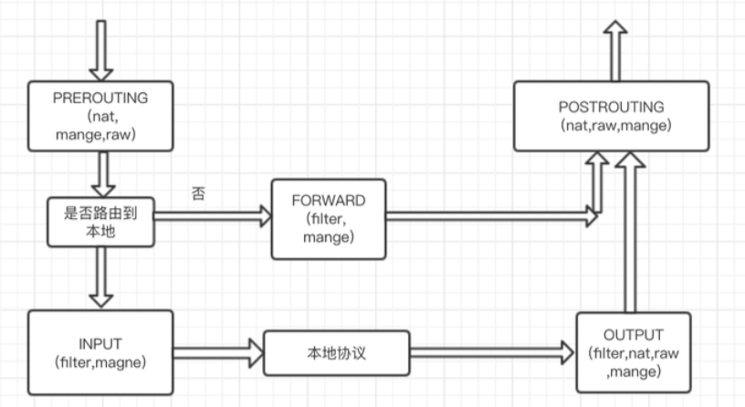

Iptables是Linux内核模块netfilter的应用程序，通过iptables这个应用程序来控制netfilter内核的行为。Linux的iptables默认是4表5链，当然也可以自定义自己的规则链。

4表： nat， manage， raw， filter，

5链： prerouting， input， output， forward, postrouting

一般情况下我们只需要关心nat和filter这个两个表。Nat表可以控制非本地的网络包，filter可以控制路由到本地的数据包。

