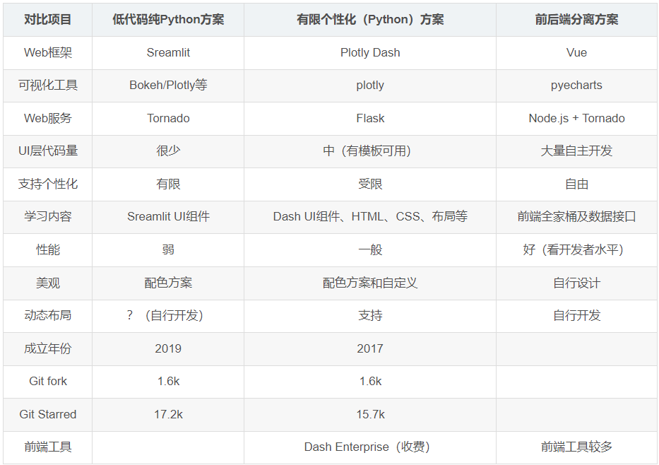

Dash 写在 Flask，Plotly.js 和 React.js 之上，非常适合在纯 Python 中，
使用高度自定义的用户界面，构建数据可视化应用程序。它特别适合使用 Python 进行数据分析的人。

#### 高级数据分析可视化低代码技术框架选型初步分析:

https://blog.csdn.net/xiaoyw71/article/details/122362853

对于数据分析、算法研发者，不熟悉前端设计、或者没有前端艺术细胞；也不想实现太复杂的网页结构；只是想把 python 程序用极短的时间快速生成一个基于 Web 的 GUI，那么，streamlit 就是一个非常好的解决方案。
对于有较充裕研发资金者，可以选择 Dash Enterprise，通过可视化开发实现低代码快速开发实现数据分析可视化应用。
对于独立自主研发产品，形成自主的产品线，那么前后端分离方案将是个不错的选择。
————————————————
版权声明：本文为 CSDN 博主「肖永威」的原创文章，遵循 CC 4.0 BY-SA 版权协议，转载请附上原文出处链接及本声明。
原文链接：https://blog.csdn.net/xiaoyw71/article/details/122362853

Tableau 或其它 BI 工具

How component from React.js to Python:
https://dash.plotly.com/plugins
Step by step of create custom component for python dash:
https://dash.plotly.com/react-for-python-developers

How Are Components Converted From React.js to Python?
Dash provides a framework that converts React components (written in JavaScript) into Python classes that are compatible with the Dash ecosystem.

To create a Dash component, fork our sample component repository and follow the instructions in the README.md: https://github.com/plotly/dash-component-boilerplate.

On a high level, this is how that works:

    Components in Dash are serialized as JSON. To write a Dash-compatible component, all of the props shared between the Python code and the React code―numbers, strings, booleans, as well as arrays or objects containing numbers, strings, or booleans―must be serializable as JSON. For example, JavaScript functions are not valid input arguments. In fact, if you try to add a function as a prop to your Dash component, you will see that the generated Python code for your component will not include that prop as part of your component's accepted list of props. (It's not going to be listed in the Keyword arguments enumeration or in the self._prop_names array of the generated Python file for your component).

    By annotating components with React docstrings (not required but helpful and encouraged), Dash extracts the information about the component's name, properties, and description through React Docgen. This is exported as a JSON file (metadata.json).

    At build time, Dash reads this JSON file and dynamically creates Python classes that subclass a core Dash component. These classes include argument validation, Python docstrings, types, and a basic set of methods. These classes are generated entirely automatically. A JavaScript developer does not need to write any Python in order to generate a component that can be used in the Dash ecosystem.

    You will find all of the auto-generated files from the build process in the folder named after your component. When you create your Python package, by default any non-Python files won't be included in the actual package. To include these files in the package, you must list them explicitly in MANIFEST.in. That is, MANIFEST.in needs to contain each JavaScript, JSON, and CSS file that you have included in your my_dash_component/ folder. In the dash-component-boilerplate repository, you can see that all the JavaScript for your React component is included in the build.js file.

    The Dash app crawls through the app's layout property and checks which component packages are included in the layout; then it extracts that component's necessary JavaScript or CSS bundles. Dash serves these bundles to Dash's front-end. These JavaScript bundles are used to render the components.

    Dash's layout is serialized as JSON and served to Dash's front-end. This layout is recursively rendered with these JavaScript bundles and React.

Dash Python > Build Your Own Components
